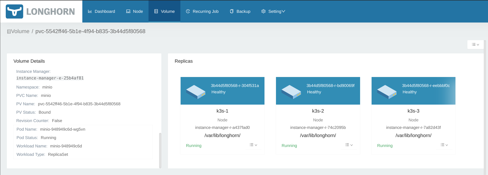

# Despliegue de MinIO usando Helm

## Parámetros por defecto de la *Helm Chart*

Por defecto, la *Helm Chart* de Minio requiere 16Gi de memoria y crea 16 PVC de 500Gi cada uno.

```yaml
...
replicas=16
...
persistence:
  size: 500Gi
...
## Configure resource requests and limits
## ref: http://kubernetes.io/docs/user-guide/compute-resources/
##
resources:
  requests:
    memory: 16Gi
```

### Despliegue de MinIO en modo *standalone*

> En modo *standalone* sólo se monta el disco "local" al servidor de MinIO. En el caso de Kubernetes, se trata de un PVC. El *backend* de almacenamiento usado depende entonces de la *StorageClass* que se use. En el caso de Longhorn, el PVC está replicado entre los nodos del clúster.
>
> 

## Variables de entorno

La documentación de MinIO ([MinIO `root` User](https://docs.min.io/minio/baremetal/security/minio-identity-management/user-management.html#minio-root-user)) indica que si las variables de entorno `MINIO_ROOT_USER` y `MINIO_ROOT_PASSWORD` no están definidas, se usa por defecto `minioadmin` tanto como nombre de usuario como contraseña para el usuario `root` de MinIO.

El usuario `root` tiene acceso a todas las acciones y recursos del despliegue, al margen de lo que se configure en el *identitiy manager*, por lo que es **muy importante** que estas variables estén establecidas.

Al desplegar MinIO mediante la *Helm Chart*, se genera por defecto el *secret* `minio` en el *Namespace* donde se ha desplegado MinIO que contiene el nombre del usuario y el password generado aleatoriamente:

```bash
$ kubectl get secret minio -n minio -o jsonpath='{.data.rootUser}' | base64 -d
bqYQhO6kBqlKGCHro1KH
$kubectl get secret minio -n minio -o jsonpath='{.data.rootPassword}' | base64 -d
Y8riwZX2fFA9TfYIi834LRsZ4otKxTSnHYiWiJwU
```

### Uso de un *Secret* existente

MinIO se puede desplegar indicando un *Secret* existente; el *Secret* debe contener los campos `rootUser` y `rootPassword`.

Si usamos la CLI de *Helm*, establecemos el nombre del *Secret* existente mediante:

```bash
helm install --set existingSecret=my-minio-secret minio/minio
```

#### Generando `rootUser` y `rootPassword`

Podemos generar un nombre de usuario y una contraseña segura utilizando herramientas comunes en Linux como `uuidgen`, `openssl`, `md5sum` y `base64` (o combinándolas).

- Usando `uuidegen`

    Una manera sencilla de generar un nombre de usuario único es mediante la herramienta `uuidgen`:

    ```bash
    $ uuidgen
    f349e1f5-cdf7-459c-a6fc-c2f71918d569
    ```

    Podemos combinarlo con `base64` (o con `md5sum`) para que no parezca un UUID:

    ```bash
    $ uuidgen | md5sum | base64
    NDIyNTM3ZmQ1ODg0NjAxNzE0OTYwNWExZGYzZmRmNTQgIC0K
    ```

- Usando `openSSL`

    ```bash
    openssl rand -hex 40
    9b3c9b579d539d92f619c95a6674dbe8331e2a2e451372fe050167c0376409f47f7e5b92fe0ccfb9
    ```

- Combinado con Sealed Secrets

    ```bash
    $ kubectl create secret generic minio-rootuser-secret \
    --from-literal=rootUser=`uuidgen` \
    --from-literal=rootPassword=`openssl rand -hex 40` \
    -n minio -o yaml --dry-run=client \
    | kubeseal --cert kubeseal.crt -o yaml \
    | tee minio-rootuser-sealedsecret.yaml
    apiVersion: bitnami.com/v1alpha1
    kind: SealedSecret
    metadata:
    creationTimestamp: null
    name: minio-rootuser-secret
    namespace: minio
    spec:
    encryptedData:
        rootPassword: AgAgIwPJPj1OV/kZmhunehyeHl0Z3nF/LLlFfAGfvV2qYZXQllYkrHYYIbs5E0U7PjGbYoq04hVmYvGZ8aUOky9sfzMW5LZoz4PkhwsCdHCfC/GO6v1b/q1c+1cNnom8rYffS9Wix/1vlMUm4phQAqeOuU+hol1iuDoN1by1diLN7K30rz9MKDY6NCPoEoq6WMl5o7bINIEYjNNN3Fw91mvn6S4qkzGqnm+6LHpevRKx5ncRMJVoS6U6YoMX1Zt0PdsNXmTWJeU5kVBgiGLKlxxctehsvD90r4ORNXAvcIAbODfvXTe9pT4nJH1UaiYR0gYkIu40ercHv/6HsD6NBouyai5AQmNCxXFAKlKpRvdGb+J4Bn5ZPu2mAtK/zOyv2Z9BCGxfjMbu/MujAB47QUwscIpSjqAL7LRvostLr6Pn3mpB43Xo4Ihx1WecVzbe2tKs6j/Nfs0Sp8TsyPVpXhTG3gWosj0GV629Qa7OZMg/H53N+v1qSsvCdwUA82+QaeZJnt0cYsBP9XYyTLArSM2RgRGF0uhXaV0EmLQ2U7ga/ukWvsfWDS2Fijv8vBYSF1qEsVM6MEsrGqnzrhCiRBPKBBev0yg7ZjqnPaG2njyU0eF1/QHY7x2xxwMwzqeYB9ASVsLMf7q2ISh9/crVUumlFtdLAvZ/xSrS3ov0bvMamN0Q4GZpNUxL4cXXnhJ4OE3dtn2LoJ3ct1sd/dxAOq15eFNLBK2g8gD+aPGnwhC6JY0jK0j+F1sUOn8ORpAwM17KY3yTn3XOYHLrZ6KtXy70SL6a10L2HUjUsjm608NyVw==
        rootUser: AgAF5Gu9wnRpuMAOnFmsWBxal0GHDLtvxcu+yXmniw8xcQCxMXxOnb47LBkXMmO+qQPeMeKWKZrSwwaVB1gYa2S8X6H5qP2qT8g76ondMNa0Yvj8Y9KJtopOAwXWKoThm3AZR2IfdH4oRnKvgK4ZLnbg6znyFKUl7lE+nrhgJDQixSH0yCnEuVjhqd3LLvuFvRV9raVbJczIytDpWoJdVxuwIbNi7fhGOUPkQnL9MkZ0Tnt27rrN59wdd5gifr9wOgbwgT2RimUUSm3hhMCesYPA0WgDawySC+mteFFkjj/cV7Z2cPxAD0YOcyBeNWIedV0Mh90mniKoGa5wzubT8uBkrukVE1CF8GPqt5n8n7v+frU2AXfnxCQi6YLq7LLhuH4mBM4MkL1BIwwfedKOA2aCx16ypFq8NKW5r4a7dj3ElQE/dAGn8FSolGe+ciMuCRW6SiVkJPclVfpreYD7/xn9DVs3lk0jCzwolrRg8CZ0gBVU9FjbUe+h3HqrcIiAOOXS+ReBhyVYSFdPBOQ6GAbcm6sI0G6nWKcckFAlL1kho0VBR0yeY7ynX/j+mde4T9RXAmd58DywpYsG36jZwuivjwSGMKJnhyI/tQRMh3oew2SHk46k0rCOTVTuA3HrIaKrAS+rJjT7hJezVGkn8+sOulu1O8+bJCwQZCc835d9BYv7XSMDn5RhVRhDYFStH8lMn5SXFy9Jj66BEK8Z430t+UnoGKd4ObFgsNPt3jJhTiVrupM=
    template:
        data: null
        metadata:
        creationTimestamp: null
        name: minio-rootuser-secret
        namespace: minio
    ```
