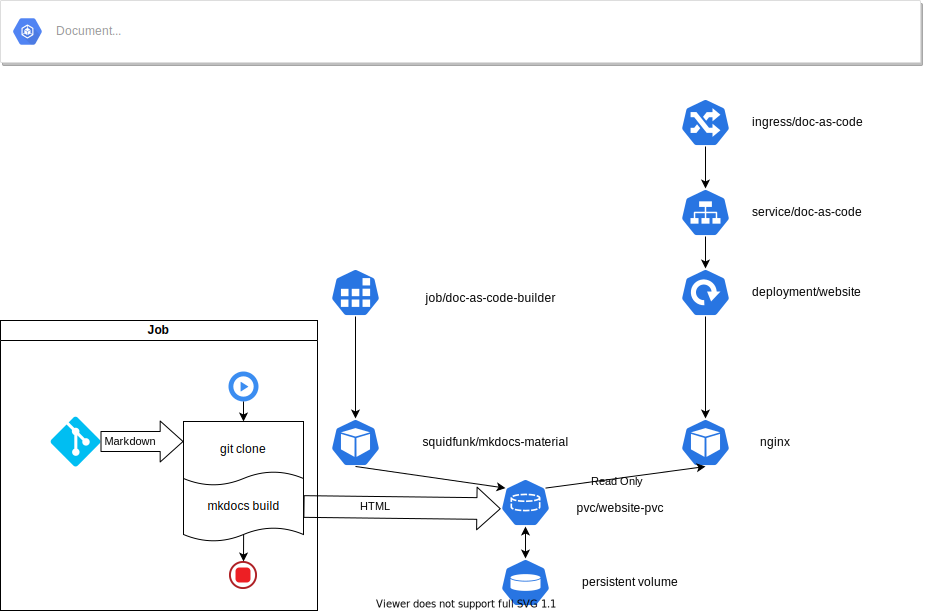

# Documentación como código (Prueba de concepto)

El objetivo de la prueba de concepto es usar MkDocs y un *Job* para, a partir de documentación en formato Markdown (guardada en un repositorio Git público), convertirla en un sitio web estático y publicarla usando un servidor web desplegado en Kubernetes.

En esta prueba asumimos que la documentación en formato Markdown ya existe y se encuentra en un repositorio Git público accesible desde el clúster de Kubernetes.

> Usaremos la documentación publicada en el repositorio <https://github.com/onthedock/k8s-devops.git>.

El proceso consiste en tres pasos:

1. Clonar el repositorio remoto localmente (dentro del contenedor) donde tenemos instalado **MkDocs** (con el tema `material`).
1. Generar la *versión  estática* (HTML, CSS, JavaScript) de la documentación.
1. Copiar la documentación a la ubicación desde donde será servida por el servidor web.

La solución final estará definida por la siguiente arquitectura:



## *Namespace*

Todos los recursos de esta solución los desplegamos en el *Namespace* `doc-as-code`:

```yaml
---
kind: Namespace
apiVersion: v1
metadata:
  name: doc-as-code
```

## Volumen compartido

El *Persistent Volume Claim* `website-pvc` se monta en los *Pods* basados en Nginx en modo *read only* (el servidor web no necesita modificar ninguno de los ficheros).

Al crear un *PVC*, si no especificamos una *storageClass*, se usa la *storageClass*  por defecto especificada en el clúster. En el caso de K3S, se usa [local-path](https://github.com/rancher/local-path-provisioner/blob/master/README.md), que permite la provisión dinámica basada en las características del volumen nativo de tipo `local` de Kubernetes. La *storageClass* `local-path` permite provisionar volúmenes de tipo `hostPath` de forma dinámica.

> `local-path` no soporta el *accessMode* `ReadOnlyMany`.

```yaml
---
kind: PersistentVolumeClaim
apiVersion: v1
metadata:
  name: website-pvc
  namespace: doc-as-code
  labels:
    app.kubernetes.io/name: doc-as-code-pvc
    app.kubernetes.io/component: storage
    app.kubernetes.io/part-of: doc-as-code
spec:
  accessModes:
    - ReadWriteOnce
  resources:
    requests:
      storage: 2Gi
```

Usamos algunas de las etiquetas recomendadas en [Recommended Labels](https://kubernetes.io/docs/concepts/overview/working-with-objects/common-labels/) de la documentación de Kubernetes para identificar los recursos desplegados.

## Servidor web

Usamos Nginx para servir la web con la documentación generada en formato HTML.

Los ficheros servidos se publican desde un volumen montado en la ruta por defecto para Nginx: `/usr/share/nginx/html`.

### *Deployment*

Definimos un *Deployment* basado en Nginx que monta el volumen que contendrá [^1] el sitio estático generado por MkDocs.

```yaml
---
apiVersion: apps/v1
kind: Deployment
metadata:
  name: doc-as-code-nginx
  namespace: doc-as-code
  labels:
    app.kubernetes.io/name: doc-as-code-nginx
    app.kubernetes.io/component: webserver
    app.kubernetes.io/part-of: doc-as-code
spec:
  selector:
    matchLabels:
      app.kubernetes.io/name: doc-as-code-nginx
      app.kubernetes.io/component: webserver
      app.kubernetes.io/part-of: doc-as-code
  replicas: 1
  template:
    metadata:
      labels:
        app.kubernetes.io/name: doc-as-code-nginx
        app.kubernetes.io/component: webserver
        app.kubernetes.io/part-of: doc-as-code
    spec:
      containers:
        - name: nginx
          image: nginx:stable-alpine
          imagePullPolicy: IfNotPresent
          ports:
          - name: http-tcp
            containerPort: 80
          volumeMounts:
            - name: webdocs
              mountPath: /usr/share/nginx/html
              readOnly: true # Montamos el volumen como ReadOnly en el webserver
      volumes:
        - name: webdocs
          persistentVolumeClaim:
            claimName: website-pvc
```

Aunque la *StorageClass* especificada para el volumen soporte múltiples modos de acceso, por ejemplo `ReadWriteOnce` y `ReadOnlyMany` sólo puede montarse usando un único modo (todos los *Pods* que lo monten debe usar el mismo *access mode*).

### Service

```yaml
---
kind: Service
apiVersion: v1
metadata:
  name: doc-as-code-web
  namespace: doc-as-code
  labels:
    app.kubernetes.io/name: doc-as-code-service
    app.kubernetes.io/component: webserver-service
    app.kubernetes.io/part-of: doc-as-code
spec:
  ports:
    - port: 80
      name: http-tcp
  selector:
    app.kubernetes.io/name: doc-as-code-nginx
    app.kubernetes.io/component: webserver
    app.kubernetes.io/part-of: doc-as-code  
```

### Ingress

En K3S el *Ingress Controller* desplegado por defecto es [Traefik](https://doc.traefik.io/traefik/).

> Para que esta configuración funcione debemos añadir una entrada en el fichero `hosts` (o en el DNS) para que el nombre definido en `spec.rules.host` sea resoluble.

```yaml
apiVersion: networking.k8s.io/v1
kind: Ingress
metadata:
  name: doc-as-code-traefik-ingress
  namespace: doc-as-code 
  labels:
    app.kubernetes.io/name: doc-as-code-traeffik-ingress
    app.kubernetes.io/component: ingress
    app.kubernetes.io/part-of: doc-as-code 
spec:
  rules:
  - host: docs.k3s.vm.lab
    http:
      paths:
      - path: /
        pathType: Prefix
        backend:
          service:
            name: doc-as-code-web
            port: 
              number: 80 

```

## Repositorio de código fuente - documentación en formato Markdown

Para esta prueba de concepto, usamos el repositorio público: <https://github.com/onthedock/k8s-devops.git>, que contiene documentación en formato [Markdown](https://daringfireball.net/projects/markdown/) y un fichero de configuración para [MkDocs](https://www.mkdocs.org/).

## *Job* - Clonar el código fuente

La imagen [squidfunk/mkdocs-material](https://hub.docker.com/r/squidfunk/mkdocs-material/) que usamos para generar el sitio estático incluye Git [^2] lo que  permite clonar el repositorio sin que sea necesario usar otro contenedor (como un *init container* [^3]) o modificar la imagen para añadir Git.

La imagen base también declara la carpeta de trabajo (`WORKDIR /docs`); clonamos el repositorio remoto en esta carpeta mediante:

```bash
git clone https://github.com/onthedock/k8s-devops.git /docs
```

> Obtener el repositorio a clonar de una variable de entorno o un *ConfigMap*.

## *Job* - Generar el sitio estático a partir del código fuente

El fichero de configuración de MkDocs `mkdocs.yaml` se encuentra en la raíz del repositorio. Como hemos clonado sobre la carpeta `/docs` especificada por la imagen como `WORKDIR`, no tenemos que realizar ninguna acción adicional para indicar a MkDocs dónde se encuentra el fichero  de configuración.

## *Job* - "Copia" a la carpeta web del servidor Nginx

MkDocs permite especificar la ruta en la que genera los ficheros HTML a partir del código en formato Markdown mediante el parámetro `--site-dir`. Para evitar tener que realizar la copia de los ficheros a la carpeta *publicada* por Nginx tras generarlos con MkDocs, especificamos directamente como carpeta de salida de MkDocs la ruta `/usr/share/nginx/html`.

De esta forma, el *clon* del repositorio de código se aloja en `/docs`, en el volumen raíz del contenedor `squidfunk/mkdocs-material`, mientras que los ficheros generados se depositan en `/usr/share/nginx/html`, que pertenece al volumen del "contenedor web"  basado en Nginx.

Cuando finaliza el *Job* de creación de la documentación, se elimina el *Pod* -y también su volumen ráíz-, que contiene la copia "clonada" del repositorio de código fuente.

Los ficheros HTML generados se han creado en el volumen de Nginx que sigue en ejecución y que por tanto se conservan al finalizar el *Job* (el volumen de Nginx se ha montado en `/usr/share/nginx/html` en el  *Pod* creado por el *Job*).

## *Job* - Fichero de definición

Después de todas estas consideraciones, la definición del *Job* queda:

```yaml
---
kind: Job
apiVersion:  batch/v1
metadata:
  namespace: doc-as-code
  labels:
    app.kubernetes.io/name: doc-as-code-build
    app.kubernetes.io/component: builder
    app.kubernetes.io/part-of: doc-as-code
  generateName: doc-as-code-builder-
spec:
  template:
    metadata:
      labels:
        app.kubernetes.io/name: doc-as-code-build
        app.kubernetes.io/component: builder
        app.kubernetes.io/part-of: doc-as-code
    spec:
      restartPolicy: Never
      containers:
        - name: doc-as-code-builder
          image: squidfunk/mkdocs-material
          imagePullPolicy: IfNotPresent
          volumeMounts:
            - name: website-docs
              mountPath: /usr/share/nginx/html
          command: ["/bin/sh"]
          args:
            - "-c"
            - "git clone https://github.com/onthedock/k8s-devops.git /docs && mkdocs build --site-dir /usr/share/nginx/html"
      volumes:
        - name: website-docs
          persistentVolumeClaim:
            claimName: website-pvc
```

La imagen `squidfunk/mkdocs-material` especifica como `ENTRYPOINT ["mkdocs"]` por lo que es necesario sobrescribir el comando que ejecuta por defecto el contenedor [^4].

Usamos `&&` para *unir* los dos comandos, lo que hace que el segundo no se ejecute si el primero devuelve un código de error.

### URL del repositorio remoto en un *configMap*

Una mejora sencilla a esta prueba de concepto es la de no especificar directamente el repositorio en el que se encuentran los ficheros en formato Markdown directamente en el comando ejecutado por el *Job*.

Creamos la estrutura básica del *configMap* usando la opción `--dry-run=client`:

```bash
kubectl create configmap doc-as-code-repo-url \
  --from-literal repo_url=https://github.com/onthedock/k8s-devops.git \
  --dry-run=client -o yaml | tee doc-as-code-repo-url-configmal.yaml
```

Editamos el fichero generado para añadir las etiquetas recomendadas:

```yaml
apiVersion: v1
data:
  repo_url: https://github.com/onthedock/k8s-devops.git
kind: ConfigMap
metadata:
  namespace: doc-as-code
  creationTimestamp: null
  name: doc-as-code-repo-url
  labels:
    app.kubernetes.io/name: doc-as-code-configmap
    app.kubernetes.io/component: configuration
    app.kubernetes.io/part-of: doc-as-code
```

Actualizamos el fichero de definición del *Job*:

```yaml
---
kind: Job
apiVersion:  batch/v1
metadata:
  namespace: doc-as-code
  labels:
    app.kubernetes.io/name: doc-as-code-build
    app.kubernetes.io/component: builder
    app.kubernetes.io/part-of: doc-as-code
  generateName: doc-as-code-builder-
spec:
  template:
    metadata:
      labels:
        app.kubernetes.io/name: doc-as-code-build
        app.kubernetes.io/component: builder
        app.kubernetes.io/part-of: doc-as-code
    spec:
      restartPolicy: Never
      containers:
        - name: doc-as-code-builder
          image: squidfunk/mkdocs-material
          imagePullPolicy: IfNotPresent
          env:
            - name: DOCS_REPO_URL
              valueFrom:
                configMapKeyRef:
                  name: doc-as-code-repo-url
                  key: repo_url
          volumeMounts:
            - name: website-docs
              mountPath: /usr/share/nginx/html
          command: ["/bin/sh"]
          args:
            - "-c"
            - "git clone $DOCS_REPO_URL /docs && mkdocs build --site-dir /usr/share/nginx/html"
      volumes:
        - name: website-docs
          persistentVolumeClaim:
            claimName: website-pvc
```

## Uso

La manera más sencilla de usar el *Job* es lanzarlo (`kubectl create -f job.yaml`) manualmente cada vez que se actualice la documentación.

Idealmente, podríamos definir un [*webhook*](https://kubernetes.io/docs/reference/access-authn-authz/webhook/) de manera que el repositorio remoto lance el *Job* tras un *commit*.

A medio camino entre estas dos soluciones, podemos implementar un [*CronJob*](https://kubernetes.io/docs/concepts/workloads/controllers/cron-jobs/) que se ejecute periódicamente.

La ejecución del *Job* dependerá del tamaño del repositorio, pero en general sólo lleva unos pocos segundos:

```bash
Cloning into '/docs'...
INFO - Cleaning site directory
INFO - Building documentation to directory: /usr/share/nginx/html
INFO - Documentation built in 2.68 seconds
```

## Referencias

- Imagen en DockerHub [squidfunk/mkdocs-material](https://hub.docker.com/r/squidfunk/mkdocs-material/)

- Parámetro de configuración de la ubicación del código fuente `docs_dir` y del sitio generado  `site_dir` en la documentación de MkDocs  en [Build directories](https://www.mkdocs.org/user-guide/configuration/#build-directories)

---

[^1]: Como el *Persistent Volume Claim* todavía no contiene ningún fichero, al acceder usando *port forwarding* obtenemos un error 403.

[^2]: Puedes comprobarlo revisando el  [`Dockerfile`](https://github.com/squidfunk/mkdocs-material/blob/master/Dockerfile)

[^3]: [(TASK) Create a Pod that has an Init Container](https://kubernetes.io/docs/tasks/configure-pod-container/configure-pod-initialization/#create-a-pod-that-has-an-init-container)

[^4]: [Define a Command and Arguments for a Container](https://kubernetes.io/docs/tasks/inject-data-application/define-command-argument-container/#notes)
