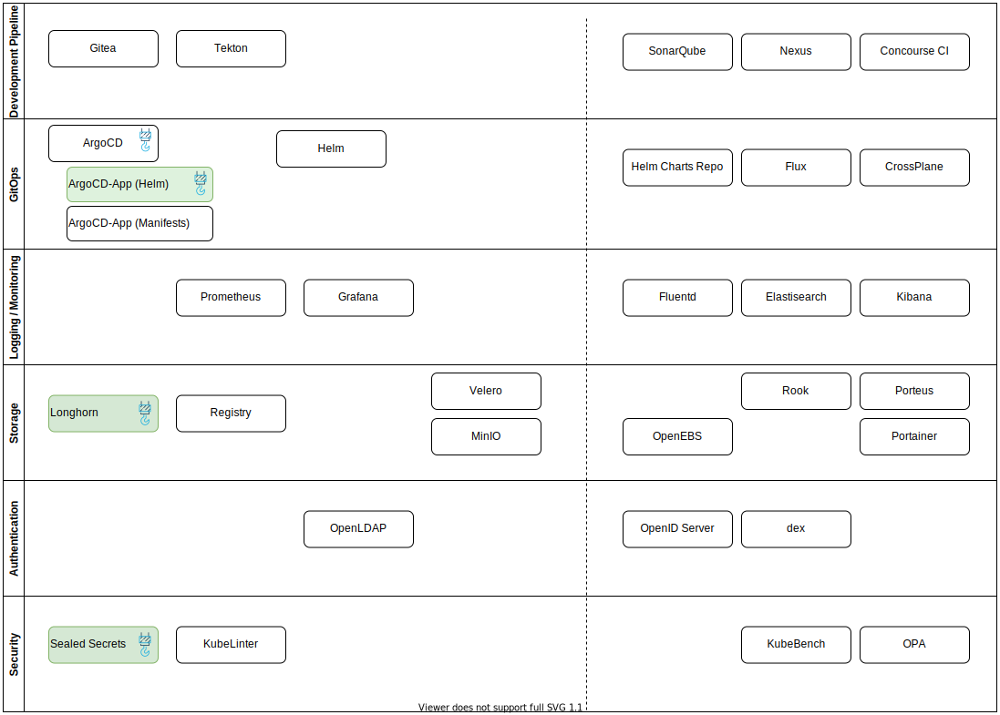

# Mapa de herramientas

> "Work in progress"

En el siguiente cuadro, se muestran las herramientas que estoy considerando.

En la parte derecha, con las que todavía no he trabajado/documentado nada en el *site*.

Sería interesante indicar, para cada herramienta, qué tipo de *despliegue* he trabajado, por ejemplo:

1. Despliegue "manual", a partir de *manifests* y `kubectl apply`
1. Despliegue vía Helm Chart
1. Despliegue usando ArgoCD
1. Despliegue vía Operador

Para no complicar mucho el *mapa*, quizás incluir un *badge* o un color.

También había pensado en incluir *dependencias*, como que por ejemplo las herramientas que necesitan autenticación deben depender de `dex` o `OpenLDAP`, pero creo que no es demasiado realista.

## Mapa de herramientas [^1]

[^1]: [source](source/map.drawio)

## Un nuevo enfoque

Con el paso del tiempo, el *site* y el número de herramientas relacionadas con "devops"y con Kubernetes en general no para de aumentar... Además, cambian con el tiempo y es necesario revisar si la documentación sigue siendo válida para la nueva versión de la aplicación.

Hasta ahora agrupo las aplicaciones en bloques "funcionales": monitoring, storage, plataforma, etc...

Sin embargo, al cambiar de equipo, tengo que montar de nuevo todo: el clúster y las aplicaciones "básicas"... Por ello estoy más enfocado en automatizar que simplemente en probar. La idea es organizar las secciones del *site* de acuerdo a esas capas que se requiere tener montadas antes de montar la siguiente, como un todo y no como aplicaciones independientes.

De momento, me voy a centrar en definir un mínimo común denominador de lo que necesito (o de lo que quiero conseguir) y más adelante ir evolucionando las diferentes "piezas" del rompezabezas, a medida que cambian de versión o las sustituyo por otras nuevas.

El objetivo que tengo en mente es el de poder desplegar un clúster de Kubernetes con las herramientas "básicas" para poder trabajar con DevOps.

Hasta ahora, el aprovisionamiento de la infraestructura no lo tenía en cuenta (o estsaba en un repositorio separado), pero desde que he empezado a usar Vagrant, creo que debería formar parte del site. En el futuro, si uso AWS a nivel personal, podría probar otras opciones como Terraform, Pulumi o incluso CrossPlane (usando un clúster "de bootstrap").

Para tener una *pipeline* automatizada (en mi caso, la aplicación es documentación), necesito un repositorio de código (Gitea), una herramienta de CI (Tekton Pipelines) y una de CD (ArgoCD).

Pensando en las pruebas, quizás este conjunto básico de herramientas, debería estar completamente automatizado para poder desplegarlo en cualquier momento (porque tiendo a reinstalar o cambiar de ordenador frecuentemente). Como "almacenamiento permanente", usaría GitHub, pero de momento quiero seguir trabajando con la idea de disponer de un entorno funcional "local", no cloud o saas.

Este clúster con Gitea+Tekton+ArgoCD sería "estable", y las pruebas las podría hacer sobre clústers "fungibles", de usar y tirar, o al menos, más volátiles. También le estoy dando vueltas a la idea de tener un clúster "estable"/"prod" y otro de "dev", donde hacer estas pruebas... Pero no tengo claro si me sale a cuenta tener tantos clústers en un equipo tan chiquitín... Otra opción sería montar de nuevo el equipo HomeLab y tener los clústers ahí.

### Herramientas auxiliares

Además de las herramientas que hacen el trabajo, hay otras que me gustaría tener desplegadas. Por ejemplo, alguna que "homogenize" la autenticación, como DEX o incluso openLDAP. Esta es una asignatura pendiente todavía.

Otra punto pendiente es el de desplegar un Registry que sea sencillo de usar. K3s creo que ya incorpora la opción de desplegar un Registry, pero de nuevo, lo tengo pendiente.

En cuanto al *storage*, hasta ahora, con un clúster mono-nodo, tenía suficiente con usar la *storageClass* que trae por defecto K3s, pero mi idea es poder usar otras, como Longhorn (de Rancher), Rook, openEBS, Minio, etc...

En el apartado de monitorización, tengo pendiente profundizar más en el uso de Prometheus y Grafana. Quizás haga pruebas también con ELK.

Estas serían las herramientas básicas:

<!-- markdownlint-disable MD007 -->
- Plataforma
    - Vagrant
    - K3s
- Básicos
    - Gitea
    - Tekton
    - ArgoCD
- Auxiliares
    - Dex
    - Prometheus
    - Grafana
<!-- markdownlint-enable MD007 -->

En general, el despliegue de estas herramientas debería realizarse a través de *charts*, siempre que sea posible.

También habrá que ver el tema de los Operadores.

Para los *Secrets*, quizás estandarice el uso de *SealedSecrets*.

### Uso de submódulos en Git

Tengo que revisar el uso de sumbódulos en Git para algunas partes (o todas) la documentación. Una opción sería tener submódulos para cada "sección", siendo k8s-devops un repositorio "sombilla", que cubra todos los repositorios.

En particular, algunos como Vagrant tiene sentido que sean "clonables" de forma independiente para poder desplegar clústers a partir de los scripts de esta carpeta.
